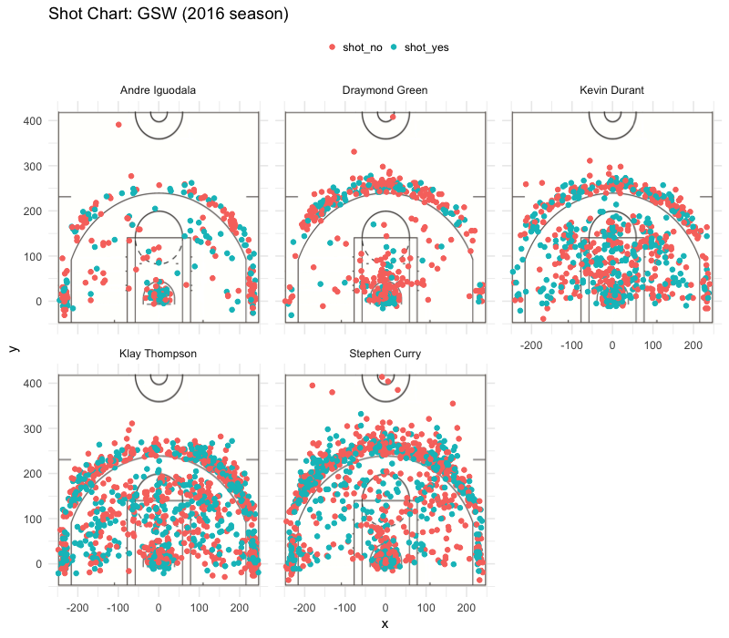

workout01-beverly-tanada
================
Beverly Leslie Tanada
3/9/2019

How are The Warriors Faring?
============================

Many are captivated by basketball stars all over the world. People have spent over thousand of dollars to watch their favorite players play, and rooted for their favorite team. It’s became a source of joy, debate, heat and tears. Over the years, one team has particularly been in the eye of the public over the other teams – the Golden State Warriors. Boasting a stellar team composed of some of the most talented players, they have risen to be one of the teams to watch out for. However, they prove it is not just all talk – below we have compiled the statistics for five of their star players: Andre Iguodala, Draymond Green, Kevin Durant, Klay Thompson, and Stephen Curry.

### Player Profile:

###### Andre Iguodala

| Profile       |                                |
|---------------|--------------------------------|
| Born          | January 28, 1984               |
| Nationality   | American                       |
| Listed height | 6 ft 6 in (1.98 m)             |
| Listed weight | 215 lb (98 kg)                 |
| Position      | Shooting guard / Small forward |
| Number        | 9                              |

###### Draymond Green

| Profile       |                    |
|---------------|--------------------|
| Born          | March 4, 1990      |
| Nationality   | American           |
| Listed height | 6 ft 7 in (2.01 m) |
| Listed weight | 230 lb (104 kg)    |
| Position      | Power forward      |
| Number        | 23                 |

###### Kevin Durant

| Profile       |                    |
|---------------|--------------------|
| Born          | September 29, 1988 |
| Nationality   | American           |
| Listed height | 6 ft 9 in (2.06 m) |
| Listed weight | 240 lb (109 kg)    |
| Position      | Small forward      |
| Number        | 35                 |

###### Klay Thompson

| Profile       |                    |
|---------------|--------------------|
| Born          | February 8, 1990   |
| Nationality   | American           |
| Listed height | 6 ft 7 in (2.01 m) |
| Listed weight | 215 lb (98 kg)     |
| Position      | Shooting guard     |
| Number        | 11                 |

###### Stephen Curry

| Profile       |                    |
|---------------|--------------------|
| Born          | March 14, 1988     |
| Nationality   | American           |
| Listed height | 6 ft 3 in (1.91 m) |
| Listed weight | 190 lb (86 kg)     |
| Position      | Point Guard        |
| Number        | 30                 |

### Shot Charts

Now that we have a short profile of each of our players, we will start with our shot chart:

Let us start with *Andre Iguodala*.The swingman who has been in the NBA All-Defensive team (not once, but twice!) seems to prefer taking three pointers than from the two-point area. He has a nice distribution of red and blue spots all over, indicating he has had his fair share of good and bad shots.

Now we move to *Draymond Green*. The three time NBA All-Star seems to be indifferent between taking three-pointers and two-pointers. Although not the strong shooter from the other five players, he is an excellent defender for the Warriors and has proven to be one of the most valuable players for the Warriors.

Playing as a small forward and power forward, *Kevin Durant* definitely prefers to do two-point shots. As we can see from his chart, the two-point area seems to be the area where he is most comfortable and confident to get his shot. He boasts a 60% success rate for his two pointers, making him a force to be reckoned with.

The five-time NBA All-Star, a two-time All-NBA Third Team honoree, and a three-time NBA champion certainly knows what he is doing. Visually, *Klay Thompson*’s chart seems very impressive. The plethora of red dots (where he was not successful with his shot) doesn’t seem to lose to the sea of blue dots where he was successful with his shots. He’s extremely clever in taking his shots, which makes him an indispensable player to the team.

Dubbed “the greatest shooter in NBA history” by experts and players, *Stephen Curry*'s chart comes to no surprise. Both Thompson and he has made a “splash” to the NBA, rewriting history for the number of combined three-pointers. Although both him and Thompson are strong shooters, we can see that Curry tends to be more of a risk taker. While Thompson sets for the “safer area” of three pointers, Curry dares to take his three-pointers from further points than his fellow teammate would.

### Getting to the numbers

The graph chart is appealing, but to fans who want to get to the brim of just how well their favourite player scores – we have several tables below.

###### 2-Pointers

    # A tibble: 5 x 4
      name           total  made perc_made
      <chr>          <int> <int>     <dbl>
    1 Andre Iguodala   210   134      63.8
    2 Draymond Green   346   171      49.4
    3 Kevin Durant     643   390      60.7
    4 Klay Thompson    640   329      51.4
    5 Stephen Curry    563   304      54.0

For two pointers, Kevin Durant takes the lead for taking the most shots for the team. Approximately 70% of his shots are two-pointers, and we could see he has a strong preference to two point shots. And his efforts are impressive as well – he boasts a 60% successful two-pointers rate. On the other hand, Andre Iguodala takes the least shots compared to his fellow teammates. However, that should not serve as a bad view of him. He has the highest success rate of two-pointers compared to the other players at nearly 64%. Draymond Green seems to be weak at two-pointers, having the lowest percentage of 49.4% success rate.

###### 3-Pointers

    # A tibble: 5 x 4
      name           total  made perc_made
      <chr>          <int> <int>     <dbl>
    1 Andre Iguodala   161    58      36.0
    2 Draymond Green   232    74      31.9
    3 Kevin Durant     272   105      38.6
    4 Klay Thompson    580   246      42.4
    5 Stephen Curry    687   280      40.8

On our chart of three pointers, the “Splash Brothers” are definitely called so for a reason. Thompson and Curry boasts a 42% and 40% success rate respectively, an impressive rate for any player on the NBA. Both players seem to also be better risk takers than their fellow teammates, where Thompson shoots more than double three-pointer than the next player, Kevin Durant. Draymond Green does not perform as well as the other players in three pointers as well, and he does seem to have a preference to two-pointers than to three-pointers.

###### All Points Overall

    # A tibble: 5 x 4
      name           total  made perc_made
      <chr>          <int> <int>     <dbl>
    1 Andre Iguodala   371   192      51.8
    2 Draymond Green   578   245      42.4
    3 Kevin Durant     915   495      54.1
    4 Klay Thompson   1220   575      47.1
    5 Stephen Curry   1250   584      46.7

Once we compile all their data together, we are able to see Kevin Durant is an agile shooter. More than half of his shots are successful, outperforming the other players overall. Green’s performance is the worse of the rest, but keeps his ground at over 40%. Iguodala’s performance shines overall as well since he is very skilled at two-pointers.

### In conclusion:

Overall, the Warriors has had a great season in 2016 overall. They have been on the top of their games over the past few years, and have been on the limelight for quite a while after their NBA drought. All these players have given stellar performance to the team, and proved that they are extremely skilled players. Five of the Warriors particularly shine: Andre Iguodala, Draymond Green, Kevin Durant, Klay Thompson, and Stephen Curry. Whether they were NBA Champions, NBA MVPs or NBA All-Stars all of them in their own right can boast about their skills, and the numbers prove it.
